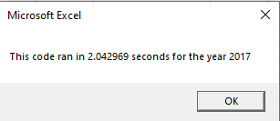
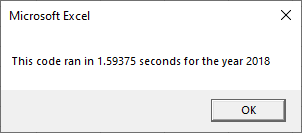
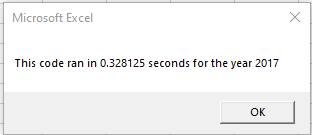
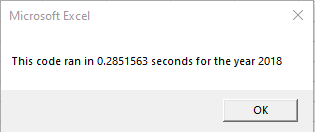

# VBA of Wall Street

## Overview of Project

### Purpose
The purpose of this analysis was to calculate the Total Daily Volume and the Return Rate of 12 different stocks.

## Results

### Stock Performance
From the analysis, I determined that in 2017 all of the stocks except TERP had positive returns. The following year, however, the returns had vastly different results. In 2018, all of the stocks except ENPH and RUN had negative returns. So if I were making a determination of which stocks to invest my money in, I would select ENPH and RUN because they had 2 consecutive years of a positive return.

### Execution Times
As you can see below, the execution times of the original scripts were about 2 seconds and 1.6 seconds.

The refactored script decreased the execution time significantly to 0.33 and 0.29 seconds respectively, allowing the end user to retrieve the information in less than half of a second. The execution time decreased by more than 75%.

## Summary
- What are the advantages or disadvantages of refactoring code?
     1) An advantage of refactoring code is increasing efficiency of your output and execution.
     2) A disadvantage of refactoring code is that it will take more time and can affect you if you are on a deadline.
- How do these pros and cons apply to refactoring the original VBA script?
     1) It was surprising to me to see how much faster the refactored code worked, however, it took a lot of brain power to understand the different methods of making the same calculations with the data. I hope that as I work with VBA more, I will be able to create more advanced code like what we used to refactor instead of just sticking to the basics. I can imagine that as the database grows, having more efficient code will be very much appreciated by the end user so that they won't have to wait as long to receive the results they need.
